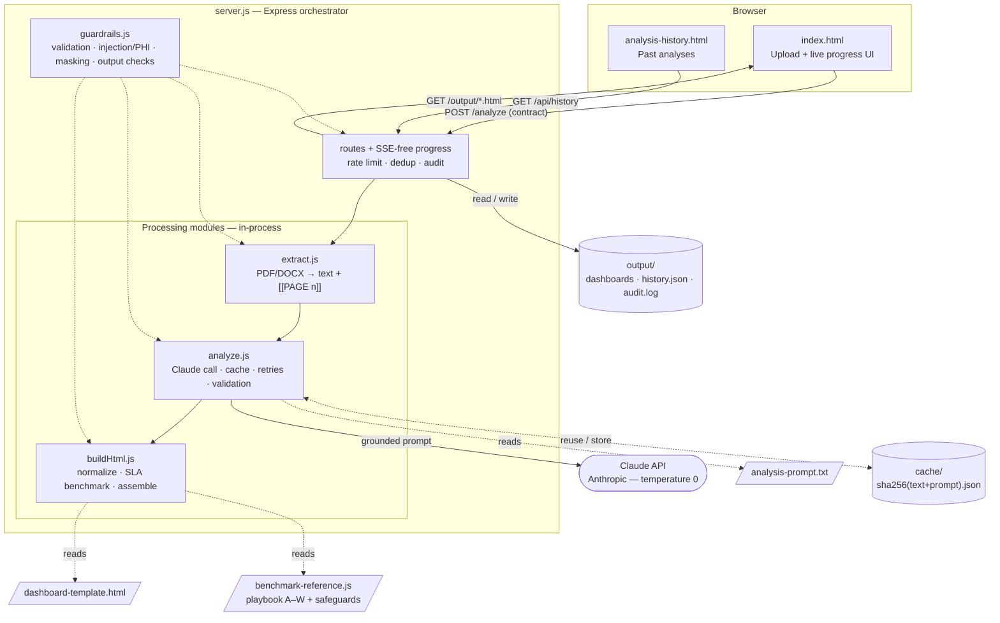
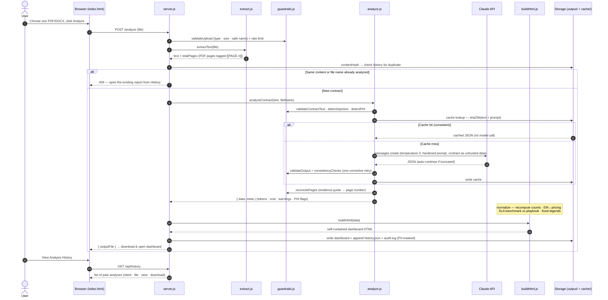

# Contract Analyzer — Architecture & Flow

## Architecture

Component view. **`server.js`** (Express) calls the three processing modules **in-process** and is the only component that reads/writes the `output/` store and the deterministic `cache/`. The stage modules stay stateless; `guardrails.js` is a pure helper used across the request.

Modules stay stateless: **`server.js`** owns all I/O (uploads are deleted right after processing; only the generated dashboard is kept). `analysis-prompt.txt`, `dashboard-template.html` and `benchmark-reference.js` are read-only inputs. The Claude API is the only external dependency.

---

## Sequence — upload to dashboard

The end-to-end run, including the guardrails applied at each step, the content de-duplication, the deterministic cache, and the in-code SLA benchmark.

**Stages as needed:** extraction and analysis always run; the **Claude call is skipped entirely on a cache hit** (same contract → same result). The SLA **benchmark** and all deterministic re-computation happen in `buildHtml.js`, so the numbers a manager reads are never trusted blindly from the model. Duplicate uploads never spend tokens — they are routed to the existing report.
